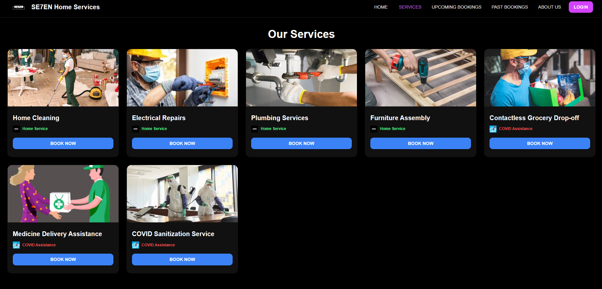

# SE7EN Home Services

SE7VEN home services provides a range of COVID home assistance services. Safe, contactless, high-trust home services including cleaning, supermarket delivery, electrical repairs, medication distribution, and sanitization are desperately needed in light of the COVID-19 epidemic. High data sharing, unrestricted communication, and physical verification are common components of traditional service-booking models, all of which raise exposure risk and go against privacy standards. This is where we come in, our app was designed with the following things on mind:
- Strong authentication, 
- minimum data retention,
- privacy-by-design

These features are guaranteed by the project's integration of a React frontend, Clerk identity platform, FastAPI backend, and SQLite database.

## Our Mission
The SE7EN Home Services app was created as a secure-by-design, privacy-preserving platform that allows users to: 
- Safely schedule necessary services

- Use as little personal information as possible when interacting with service providers

- Steer clear of needless interaction and exposure

- Get necessary services at a lower risk

## Security features implemented
1. JWKS-Based JWT Verification

    Prevents forged tokens by validating:
    - Signature

    - Expiry

    - Issuer

    - Audience

2. 🔒 Webhook Signature Validation

    Ensures only Clerk can trigger user provisioning.

3. 🔒 CORS Restriction

    Only frontend origin allowed.

4. 🔒 No Sensitive Booking Storage
    
    All booking data handled exclusively on client.

5. 🔒 Minimal Attack Surface
    
    Very few exposed routes:
    - /webhooks/clerk
    - /bookings, /services, etc.

## Get started
### Getting the backend running

#### 1. Installing the dependencies
    cd backend
    python -m venv .venv
    .venv\Scripts\activate
    pip install -r requirements.txt

#### 2. Set clerk secrets
Create a `.env` file in 'backend' folder and, add your clerk weebhooks secret and your clerk JWKS url
`CLERK_JWKS_URL=https://clerk....well-known/jwks.json`
`CLERK_WEBHOOK_SECRET=whsec_xxxxx`

#### 3. Setting the public url
In `main.py` find origins and replace your public url `YOUR_PUBLIC_URL` so that clerk can recognize the url and validate webhooks.

#### 4. Starting the backend
`uvicorn app.main:app --reload --port 8000` this command starts the backend at port 8000.

___

### Getting the frontend running

#### Installing all the frontend dependencies
---
    cd ../
    cd frontend
    npm install

#### 2. Set Clerk secrets
---
Create a `.env` file in the 'frontend' folder and add your clerk public key
`REACT_APP_CLERK_PUBLISHABLE_KEY=pk_test_xxxxxxxx`

#### 3. Starting the frontend
---
`npm start`

The webpage has started at `http://localhost:3000` copy paste the url in your browser to access the site.

